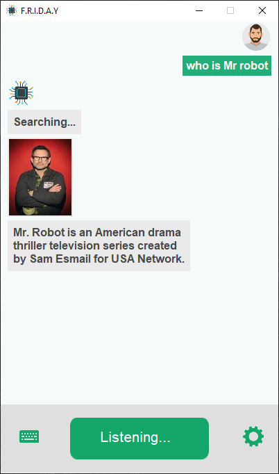
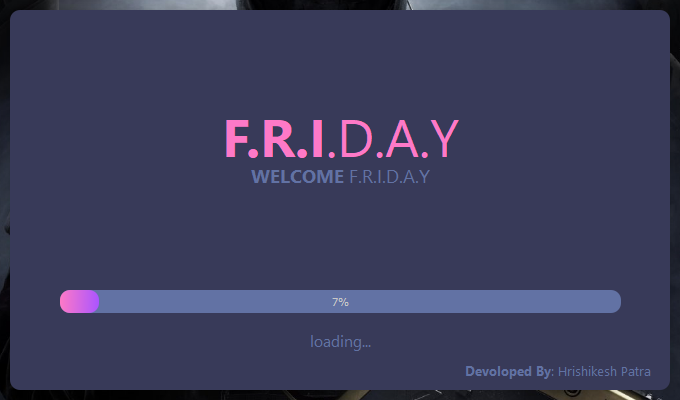

# F.R.I.D.A.Y-personal-voice-assistant
F.R.I.D.A.Y, python voice controlled assistant.

**Made In Python 3.9.0 With Tkinter Gui**

***Tasted In Windows 10 I Have No Idea About Linux***

## Installation 
**Install all required modules or run requirment.txt (pip install -r requirements.txt)**
**Run F.R.I.D.A.Y.py**
**Enjoy.**

### Requirements
- pillow 
- playsound
- SpeechRecognition
- pyttsx3==2.7
- google
- PySide2
- translate
- wikipedia
- geopy

### Features
- Simple & Clean UI
- Available With Light & Dark Mode
- You Can Chouse Your Avatar
- You Can Change Your Assistant Voice, Voice Rate, & Volume
- You Can Use Keyboard For Giving Command

### F.R.I.D.A.Y Features 
- Can Performed Normal Chat
- Google Search (Search Result Show With Image If Available)
- Wikipedia Search
- Youtube Search
- Dictionary Search
- Show Map Or Directions
- Toss A Coin For You
- Roll A Dice For You
- Play Rock, Paper, Scissors Game With You
- Can Solve Math Problem
- Can Creat & Shoe TODO List
- Can Creat HTML Project
- Creat Normal Text File As Well As .py .c .css .java .js File
- Can Send Whatsapp Message 
- Can Send EMAIL*

*N.B: If You Want To Use Email Service You Need To Add Your Email Address And Password In  **“webScrapping.py”** ***Email*** & ***Password*** Variable.
You Also Need To Turn On Less Secure App In Your Google Account. 

### Screenshot

- Light Mode
1)

2)

3)

4)

5)

6)

- Loading Screen

- Dark Mode
1)

2)

3)

4)

**Drop a STAR if you like it!!!** 😃
